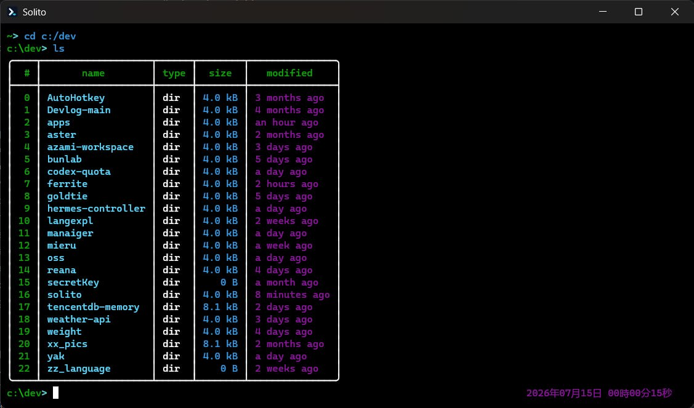

# Solito Terminal Emulator

Solito is a small, native terminal emulator for Windows, built with Rust. It combines a GPU-rendered interface with PTY-backed shell sessions and uses the platform's familiar shell by default (`pwsh` on Windows, `bash` on Linux, and `zsh` on macOS).

Solito uses `winit` for its native window, `wgpu` for rendering, `glyphon` for text, and `portable-pty` for shell sessions.

## Development

Start with the Japanese [architecture and maintenance guide](docs/architecture.md).
It maps input, PTY output, resizing, rendering, and common bug symptoms to the
first source file to inspect.

## Features

- GPU-rendered terminal text
- PTY-backed shell sessions
- Multiple tabs with terminal-style shortcuts
- Keyboard copy mode
- Configurable font and window backdrop

since 2026/04/15

## License

MIT licensed. See `LICENSE`.
