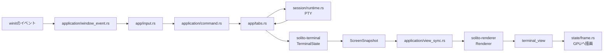

# Solito 保守ガイド

この文書の目的は、Solitoを初めて読む人が「どこから追えばいいか」で迷わないようにすることです。
実装の詳細より、データがどこから来て、誰が変更し、どこへ渡すかを説明します。

## 最初に覚える3つ

1. `solito` はイベント、タブ、PTYセッションをまとめるアプリ層です。
2. `solito-terminal` はPTY出力を端末セルの状態へ変換します。
3. `solito-renderer` は端末セルをGPUで描画します。

端末の大きさは `TerminalSize { cols, rows }`、ウィンドウの大きさは
`PhysicalSize<u32>` です。前者は文字セル、後者はピクセルなので混ぜないでください。

## 全体像



## 主要な処理経路

### キー入力

```text
winit WindowEvent
  -> app/application/window_event.rs
  -> app/input.rs
  -> AppCommand または SessionInput::Write
  -> app/application/command.rs または session/runtime.rs
  -> PTY
```

- ショートカットの変更は `app/input.rs`
- コマンド実行時の状態変更は `app/application/command.rs`
- シェルへ送るバイト列は `app/input.rs`

### シェル出力

```text
PTY reader thread
  -> Tabのoutput_rx
  -> Tabs::drain_outputs
  -> TerminalState::apply_terminal_output
  -> ScreenSnapshot
  -> application/view_sync.rs
  -> Renderer
  -> terminal_view
  -> state/frame.rs
```

- ANSIシーケンスの解釈は `decodesc`
- カーソル移動や文字セル更新は `solito-terminal/src/screen/editor.rs`
- ANSI色の適用は `solito-terminal/src/screen/sgr.rs`
- グリフ位置と日本語文字幅は `solito-renderer/src/terminal_view/text.rs`

### リサイズ

```text
WindowEvent::Resized (pixels)
  -> Renderer::terminal_size_for
  -> TerminalSize (cols, rows)
  -> AppCommand::Resize
  -> Tabs::resize_all
       -> TerminalState::resize
       -> SessionInput::Resize -> PTY
  -> Renderer::resize
```

リサイズバグは、まず `TerminalSize` と `PhysicalSize` のどちらを扱っているか確認してください。

## モジュールの責任

| 場所 | 担当すること | 担当しないこと |
| --- | --- | --- |
| `app/application.rs` | 所有関係、起動、winitライフサイクル | キー判定、描画詳細 |
| `app/application/window_event.rs` | WindowEventの振り分け | アプリ状態の変更規則 |
| `app/input.rs` | キーをコマンドまたはPTY入力へ変換 | コマンドの実行 |
| `app/application/command.rs` | AppCommandの実行 | GPU描画 |
| `app/application/view_sync.rs` | アプリ状態をRendererへ同期 | ANSI解析 |
| `app/tabs.rs` | タブと端末セッションの所有 | グリフ配置 |
| `session/runtime.rs` | PTYの生成、読み書き、リサイズ | 端末セル更新 |
| `solito-terminal` | バイト列からScreenSnapshotを作る | GPU描画 |
| `solito-renderer/terminal_view` | セルを描画用テキストと矩形へ変換 | PTY通信 |
| `solito-renderer/state/frame.rs` | 1フレームの準備、描画、present | 端末の意味解釈 |
| `solito-renderer/state/surface.rs` | surfaceとWindows背景効果 | テキスト整形 |

## バグ別の開始地点

| 症状 | 最初に開く場所 |
| --- | --- |
| キーが反応しない、別の文字が入る | `solito/src/app/input.rs` |
| タブ切り替え、追加、終了がおかしい | `solito/src/app/tabs.rs` |
| コピー範囲がおかしい | `solito/src/app/copy.rs` |
| コピー時の移動がおかしい | `solito/src/app/copy/movement.rs` |
| シェル入出力が止まる | `solito/src/session/runtime.rs` |
| ANSIカーソル移動や改行がおかしい | `solito-terminal/src/screen/editor.rs` |
| ANSI色がおかしい | `solito-terminal/src/screen/sgr.rs` |
| 日本語や全角文字がずれる | `solito-renderer/src/terminal_view/text.rs` |
| スクロール位置がおかしい | `solito-renderer/src/terminal_view/viewport.rs` |
| リサイズ後だけ崩れる | `application/window_event.rs` → `Renderer::terminal_size_for` |
| GPU surfaceエラー、真っ黒になる | `solito-renderer/src/state/frame.rs` |
| Acrylicや背景がおかしい | `solito-renderer/src/state/surface.rs` |

## 壊してはいけない境界

- PTY出力は `TerminalState` だけが端末状態へ変換します。
- `ScreenSnapshot` はアプリ層と描画層の受け渡しデータです。
- 全角文字は先頭セルと `is_wide_continuation` セルの2セルで表現します。
- rendererはANSIシーケンスを解釈しません。
- applicationはグリフ幅やGPU resourceを直接操作しません。

## バグ修正の進め方

1. 上の表から最初のファイルを1つ選びます。
2. その層で再現テストを書きます。
3. pureな計算なら、PTYやGPUを起動せず単体テストで直します。
4. `cargo test --workspace` を実行します。
5. `cargo clippy --workspace --all-targets -- -D warnings` を実行します。

分からなくなったら、呼び出し元へ無限に戻るより、
`ScreenSnapshot`、`AppCommand`、`TerminalSize` のどの境界にいるかを確認してください。
